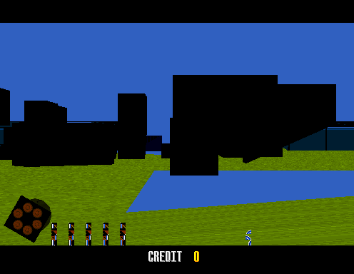
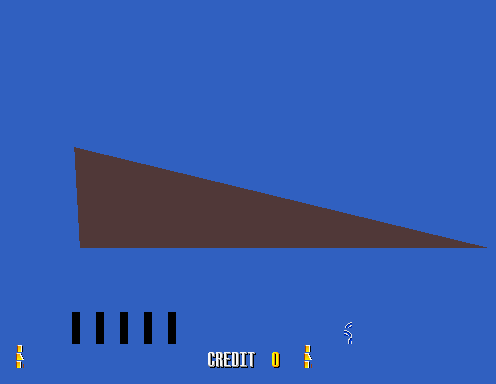

# Virtua Cop — Static Recompilation

> Sega's 1994 arcade lightgun game, rebuilt from its ROM into native C. No
> emulator: the i960 program *is* the executable.

**Virtua Cop** (Sega AM2, 1994) was the game that taught a generation what a
lightgun could do with polygons behind it. It ran on Sega **Model 2** — an
Intel i960KB driving a Fujitsu TGP math coprocessor, a custom geometry engine
and a Lockheed-Martin-derived rasterizer, which together made it the
best-looking thing in an arcade in 1994.

This project takes the game's i960 program ROM, disassembles it, lifts all
2,095 functions to C, and links the result against
[**model2recomp**](https://github.com/sp00nznet/model2recomp) — the Model 2
board as a native C library. The output is a Windows executable running
Virtua Cop's own code on your CPU.



*Attract mode, rendered natively. The recompiled i960 builds the display list,
the emulated MB86233 coprocessor computes the matrices from microcode the game
uploaded at boot, and model2recomp's geometry engine and rasterizer draw it —
with the System 24 tilemap HUD composited on top.*

**[Join the sp00nznet recomp Discord](https://discord.gg/CRpzGWZFcu)** — where
this and the sibling recomp projects are developed in the open.

---

## Status

**It boots, runs its own frame loop, and renders.** Attract mode draws the
stage geometry with textures, perspective-correct mapping, z-sorting and the
hardware's real colour path, with the tilemap HUD over it.

| | State |
|---|---|
| i960 program lifted | **2,095 functions**, ~121,000 lines of generated C |
| Boot | Full chain: reset stub → IAC reinitialize → firmware entry → `main` |
| Frame loop | The game's own, at its video-status busy-wait |
| Interrupts | VBlank handler dispatched at the field boundary |
| Geometry + rasterizer | Working — textured, lit, z-sorted |
| Tilemaps | Working — four System 24 layers, two passes around the 3D |
| Math coprocessor | Working — MB86233 emulated, runs the game's microcode |
| Input | **Working.** Mouse is the lightgun; coin, start, service and test reach the game |
| **Polygons draw too dark** | **Cause found**, not fixed - the interrupt frame, see below |
| **Coins do not become credits** | The I/O board's settings EEPROM is not modelled |
| **Sound** | **Not implemented.** No 68000, no MultiPCM. |

Not playable yet: coins reach the game but do not become credits, because the
I/O board's settings EEPROM is not modelled. Everything measured is in
[docs/technical/known-issues.md](docs/technical/known-issues.md).

**The black scenery has a cause.** The VBlank handler is dispatched without the
stack frame the hardware pushes, so its `ret` unwinds one frame too far every
field; within a few hundred fields the frame pointer leaves work RAM and the
guest reads ROM for its stack temporaries. One of them is a palette fade
counter, and the resulting bogus fade copies the i960 boot header over the
polygon palette. Fixing the frame properly stops the game rendering at all, for
reasons not yet found - that is the next thing to solve.

### Where it came from

The scene did not always draw. For a while it rendered as a flat blob, because
the game builds every transformation matrix on the math coprocessor and that
coprocessor was a FIFO loopback — so the game read its own inputs back as a
matrix, complete with a NaN:



*An earlier build, before the MB86233 was implemented: 44% of polygons sorted
into the nearest z bucket and occluded everything behind them, leaving one
enormous foreground triangle over the sky.*

The full story is in
[model2recomp's coprocessor notes](https://github.com/sp00nznet/model2recomp/blob/main/docs/technical/tgp-coprocessor.md).

## The Hardware

| Subsystem | Chip | In this project |
|---|---|---|
| Main CPU | Intel i960KB @ 25 MHz | **Recompiled to C** — this repository |
| Math coprocessor | Fujitsu MB86233 "TGP" | Emulated by model2recomp, running the game's own uploaded microcode |
| Geometry engine | Custom TGP-based | Modelled directly by model2recomp |
| Rasterizer | Sega / Lockheed-Martin custom | model2recomp — point sampled, no bilinear or mipmaps |
| Tilemaps | Sega System 24 | model2recomp — four 8×8 4bpp layers |
| Sound | 68000 @ 10 MHz + YM3438 + 2× MultiPCM | Stub |
| I/O | Model 1 I/O Board 2 (837-11694), lightgun FPGA | Buttons and lightgun reach the game through DPRAM; the board's settings EEPROM does not exist |

## Quick Start

You need a Virtua Cop ROM set you dumped or own. None is distributed here.

### Prerequisites

- **CMake ≥ 3.20**
- **A C17 compiler** — MSVC 2022 tested
- **SDL2** — via vcpkg on Windows
- **Python 3.10+** for the ROM and lifting tools

### Build and run

```bash
git clone --recurse-submodules https://github.com/sp00nznet/virtuacop.git
cd virtuacop

# 1. Turn your ROM set into the flat images the runtime loads
python tools/rom_loader.py vcop.zip roms

# 2. Generate the recompiled C from the program ROM
#    (already committed - only needed if you change the lifter)
python -m tools.i960_lifter roms/program.bin src/recomp

# 3. Build
cmake -B build -DCMAKE_TOOLCHAIN_FILE=C:/vcpkg/scripts/buildsystems/vcpkg.cmake \
               -DVCPKG_TARGET_TRIPLET=x64-windows
cmake --build build --config Release

# 4. Run
./build/Release/vcop.exe ./roms
```

Cloned without `--recurse-submodules`? `git submodule update --init`.

**Attract mode takes about 20 seconds of game time to start drawing**, so a
short run legitimately shows a black screen. For a bounded test:

```bash
VCOP_MAX_FRAMES=2000 MODEL2_SCREENSHOT=out.ppm ./build/Release/vcop.exe ./roms
```

### Controls

The mouse is player 1's lightgun.

| | |
|---|---|
| Left button | Fire at the crosshair |
| Right button | Fire off-screen — which is how this game reloads |
| Middle button | Insert a coin |
| `5` / `1` | Coin / Start |
| `9` / `F2` | Service / Test |

The long version of all of this, including what the ROM images are and why,
is in **[docs/GETTING_STARTED.md](docs/GETTING_STARTED.md)**.

## How It Works

```
   vcop.zip  (your ROM set)
       |
       |  tools/rom_loader.py   interleave 16-bit halves into 32-bit words
       v
   roms/program.bin  data.bin  polygons.bin  textures.bin  copro_tables.bin
       |
       |  tools/i960_lifter.py   discover functions, lift i960 -> C
       v
   src/recomp/*.c    2,095 functions, ~121K lines
       |
       |  MSVC / CMake
       v
   vcop.exe  --------- links --------->  model2recomp
                                         (bus, geometry engine, rasterizer,
                                          MB86233 coprocessor, tilemaps,
                                          timers, interrupts, I/O, SDL2)
```

At runtime the recompiled `main` never returns — it owns the frame loop and
busy-waits on the video status register. That read is the frame boundary. See
[model2recomp's execution model](https://github.com/sp00nznet/model2recomp/blob/main/docs/technical/execution-model.md).

## Repository Structure

```
virtuacop/
├── ext/model2recomp/       The Model 2 board, as a submodule
├── include/vcop/
│   ├── i960_ops.h            i960 instruction semantics the generated C calls
│   └── functions.h           vcop_register_all()
├── src/
│   ├── main/main.c           Entry point: init, ROM load, boot chain
│   └── recomp/               Generated. 2,095 lifted functions + dispatch table
├── tools/
│   ├── rom_loader.py         ROM set -> flat images, plus an i960 disassembler
│   └── i960_lifter.py        i960 machine code -> C
└── docs/                     Getting started + technical notes
```

`src/recomp/` is generated but **committed**, so the repository builds without
Python and so that hand-applied fixes are reviewable in diffs.

## Documentation

- **[Getting Started](docs/GETTING_STARTED.md)** — from your ROM dump to a
  running executable, with what to expect at each step.
- **[Boot Sequence](docs/technical/boot-sequence.md)** — how the i960 reaches
  `main`, and the five things that blocked it on the way.
- **[The Lifter](docs/technical/lifter.md)** — how i960 machine code becomes C,
  and the decode mistakes that cost the most time.
- **[Known Issues](docs/technical/known-issues.md)** — the dark-polygon bug,
  missing input, missing sound, with everything measured so far.

Hardware documentation — memory map, graphics pipeline, coprocessor, execution
model — lives in [model2recomp's
docs](https://github.com/sp00nznet/model2recomp/tree/main/docs), because it is
true of the board rather than of this game.

## ROMs

**Not distributed, and never will be.** Use your own dump of the MAME `vcop`
(Revision B) or `vcopa` (Revision A) set.

```
Game ID:    833-11127 VIRTUA COP
ROM board:  834-11128
```

`tools/rom_loader.py` produces `program.bin`, `data.bin`, `polygons.bin`,
`textures.bin`, `copro_tables.bin`, `sound_program.bin`, `samples1.bin`,
`samples2.bin`, plus `disasm.txt` and `functions.txt` for reference.

`copro_tables.bin` comes from the CPU board ROMs `opr-14742a.45` and
`opr-14743a.46` and holds the coprocessor's sin/cos, atan, 1/x and 1/√x
tables. Without it nothing rotates.

## How You Can Help

- **The I/O board settings EEPROM**, so that a coin becomes a credit.
- **The interrupt frame.** See [known-issues.md](docs/technical/known-issues.md).
- **Sound.** A 68000 core and MultiPCM in model2recomp.
- **Another Model 2 title.** The tooling here is not especially Virtua
  Cop-specific; pointing it at Daytona USA would find out how much.

## Related Projects

- **[model2recomp](https://github.com/sp00nznet/model2recomp)** — the Model 2
  board as a C library. This game links it.
- **[ps3recomp](https://github.com/sp00nznet/ps3recomp)**,
  **[xboxrecomp](https://github.com/sp00nznet/xboxrecomp)** — sibling toolkits
  for PS3 and original Xbox.
- **[N64Recomp](https://github.com/N64Recomp/N64Recomp)** — showed static
  recompilation of a console target was practical.
- **[MAME](https://github.com/mamedev/mame)** — the source of essentially
  everything known about Model 2 hardware.

## Legal

This repository contains **recompilation tooling and generated code only**. No
copyrighted ROM data, no game assets, no Sega code is included or
redistributed. You must supply your own legally obtained ROM dump.

The generated C in `src/recomp/` is a mechanical translation of the game's
machine code and is only useful with a ROM dump you already have — it is not
a substitute for owning the game.

Virtua Cop and Model 2 are trademarks of Sega. This project is not affiliated
with or endorsed by Sega.

## License

**MIT** — see [LICENSE](LICENSE). This covers the tooling in `tools/`, the
runtime glue in `src/main/` and `include/vcop/`, and the documentation.

## Credits

**Sega AM2** made the game. The **MAME team** — R. Belmont, Olivier Galibert,
ElSemi, Angelo Salese, Matthew Daniels, Farfetch'd, Dirk Best — reverse
engineered the hardware over two decades; without their Model 2 driver none of
this would be possible.

Built with [Claude Code](https://claude.ai) (Anthropic).

## Changelog

### v0.4.0 — *"Real Silicon"* (September 2026)

- **The scene draws.** The flat blob was never the recompiled floating point —
  the game builds its matrices on the MB86233 coprocessor, which was a FIFO
  loopback. model2recomp now emulates the DSP and runs the microcode the game
  uploads. Attract mode renders the stage geometry with textures.
- `tools/rom_loader.py` extracts the CPU board's math-table ROMs
  (`opr-14742a`, `opr-14743a`) to `copro_tables.bin`, which the coprocessor
  needs for sin/cos, atan, 1/x and 1/√x.
- Fixed every-other-field blanking: rendering is destructive, so a field with
  no new display list now keeps the bitmap it has.

### v0.3.0 — *"Attract Mode"* (September 2026)

- **Attract mode renders.** 3D polygons over the background with the tilemap
  HUD on top; "CREDIT 0" draws legibly from the game's own data.
- Texture mapping and the hardware's real colour path — palette entry to one of
  32 ramps per channel, indexed by luma, then gamma.
- **Function discovery past alignment padding.** The old rule gave up on the
  first pad word after a `ret`, which lost every function only reachable
  through a function pointer — including the entire scene renderer.
- Interrupt handlers lifted: discovery now seeds from the interrupt table the
  way the processor reaches it, so the game does per-frame work.

### v0.2.0 — *"First Frame"* (September 2026)

- **Boots into its own frame loop.** The full chain: reset stub at `0x5D0`,
  IAC reinitialize, firmware entry at `0x6A0`, `main` at `0x2370`.
- Blockers cleared: `bal` targets registered as functions (and no longer
  truncating their callers); the I/O board command handshake; the copro
  FIFO-control polarity; and the lifter's floating-point REG mode bits, which
  had made every real-number operation garbage.

### v0.1.0 — *"Lifted"* (March 2026)

- ROM loader, i960 disassembler, and the static recompiler.
- First build that compiles and links against model2recomp and SDL2.
