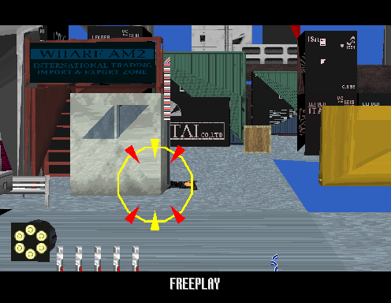

# Known Issues

What is fixed, what is not, and what was measured on the way.

---

## 1. Polygons drew too dark — fixed

**Was:** most scenery drew as solid black silhouettes, and the game never got
past its attract loop.

**Cause.** Three bugs, and the middle one was hiding the other two.

1. **A `ret` is not the end of a function.** A conditional branch that skips
   over an early return leaves one in the middle; the code after it is a
   continuation, not an entry point. Discovery split real functions there and
   left paths that fall off the end of their generated C without reaching the
   `ret` that pops the frame.
2. **Switch jump tables were never discovered.** `ld table[gN*4], gM` followed
   by `bx (gM)` dispatches through code addresses nothing else names, so the
   dispatch missed, the switch did nothing, and the caller's frame leaked.
3. **The interrupt frame was unbalanced the other way.** The VBlank handler was
   dispatched without the frame the hardware pushes, so its `ret` unwound one
   too far - which cancelled the two leaks above and hid them, while walking
   the frame pointer down out of work RAM instead.

With the frame pointer in ROM, `0x00009700` stored a zero to `0x44(fp)` and
read back `0x000008A0` out of the i960 interrupt table. That denormal looked
like a live palette fade; `0x00003B68` had no case for the uninitialised
selector at `0x0050F360` and returned an index where a pointer belongs; and the
fade copied 455 words from address 1 — the i960 boot header — into the polygon
palette.

```
[pal] 1000: 0000 0000 00B0 0000 0000 0000 05D0 0000 F980 FFFF ...
```

**The trap was that fixing any one of the three alone made things worse**, which
is why the interrupt frame looked for a long time like a change that broke
rendering. Two errors were cancelling. Fixed together:



Function count went 2,095 → 1,559 with the first rule, then → 1,747 with the
jump tables. Both live in [lifter.md](lifter.md).

---

## 2. The guest stack ran into the game's own variables — fixed

**Was:** the game reached the stage select and then sat on the Sega warning
screen forever, redrawing it, while the 3D drew a fraction of the screen.

**Cause.** The stack has about 2KB to work with. Its base is `0x00500C00` and
the state machine's variables start at `0x005014B0`; 48 frames of 64 bytes is
enough to reach them, and a leak got there. A local store from a frame that had
climbed too high landed on the attract state at `0x005016CC` and on the
countdown beside it. The countdown went negative, and state 0 — which draws the
warning screen and advances when the countdown reaches exactly zero — sat there
subtracting one from a number that would never be zero again.

`MODEL2_WATCHPATH` is what found it: the dispatch ring named the chain down to
the function, and the store's offset from `fp` made it a local, not a global.

**The leak.** A branch that leaves the function it is in has nowhere to land
when the landing site is not a registered function — which is what happens
whenever a real function's blocks are not contiguous. A switch dispatched
through `bx` makes them exactly that: the case bodies sit wherever the compiler
put them and branch back into the middle of the dispatcher. The dispatch
misses, control unwinds to the caller, and the frame is never given back.

The fix is to give it back, with the same guard a missed `call` already gets:

```c
{ if (!func_table_call(0x00074E44)) i960_do_ret(); return; }
```

Plain branches only. A missed `bx (gN)` is how a `bal`-called leaf returns and
is correct as it stands; popping a frame there unwinds one too far and the game
never finishes booting.

**Registering the landing sites instead does not work**, and this is the third
time the project has learned it: splitting a genuine function costs more than a
leak does. Doing it for the jump-table chains — 56 entries, a bounded and
principled set — dropped attract from 1.2M polygons a field to 4,155 and
stopped the 3D drawing at all. Doing it for every branch that crosses an extent
boundary was worse.

`MODEL2_LEAK` now reports nothing on either path and the guest stack
high-water is `0x00500C80` — two frames — where it used to reach `0x005BFB40`
in attract and `0x00501800` in game.

---

## 3. Tilemap colour and the window layer — fixed

Two bugs in model2recomp that between them hid most of what the game draws.

**Palette entries are not colours.** They were expanded 5:5:5 straight to 8:8:8.
Each 5-bit field selects one of 32 ramps in colour-translate RAM, and the
tilemaps read those ramps at luma `0x40` before the gamma curve, as
`model2_v.cpp`'s `screen_update` does. Skipping that ignored the game's own
colour setup: on the warning screen every pen landed within a shade of white,
so white text sat invisibly on a white background.

**The window tilemap is not a layer.** The four tilemaps are two pairs, a
"screen" half and a "window" half, and `segaic24.cpp`'s `draw_common` never
touches the window half in normal mode — only a split selected by the pair's
control word makes it draw, clipped to its own region. model2recomp drew it
unconditionally, and Virtua Cop fills tilemap 1 with a single solid tile, so a
flat fill covered the entire screen: text, 3D and all. That fill is what the
"flat light grey" in front of the in-game 3D actually was.

---

## 4. Getting into a stage

The game boots, runs its attract cycle, takes a coin and a start, draws the
stage select, and plays: `MODEL2_INPUT=coin1,start1,fire` reaches the wharf in
first person with the ammo HUD over it, about 1,500 polygons a field filling
the screen.

What is not verified is a whole stage. The headless input driver pulses
buttons on a fixed schedule and the gun sits wherever it was left, so it cannot
aim at a stage-select panel or shoot an enemy on purpose; and the field
boundary is wall-clock driven, so two runs diverge. Playing properly needs a
person at the mouse.

The in-game colour translate is warm — red about 15/255 above green and blue,
where attract writes the three channels equal. That is the game's own writes,
not the renderer, but whether it is the intended grade or a fade caught
part-way is not established.

---

## 5. Coins do not become credits

The board defaults to **free play** without its settings EEPROM, so the game
starts on Start alone and never needs a credit. Input itself works end to end:
coin, start, service and test all reach the game's own input word at
`0x0050154C` as clean edges, and the mouse aims and fires.

What is missing is the I/O board's 93C46, which holds coinage and the game's
settings. MAME runs the board's real Z80 firmware and that firmware reads the
EEPROM; model2recomp publishes DPRAM directly and has nothing to put in the
settings area.

---

## 6. No sound

**Symptom.** Silence.

**Cause.** model2recomp's `src/sound.c` answers the UART handshake so the game
does not wait on it, and nothing else. The sound board is a 68000 at 10 MHz
with a YM3438 and two MultiPCM chips, on the other side of that UART.
`roms/sound_program.bin`, `samples1.bin` and `samples2.bin` are extracted and
unused.

This is a large job and it belongs in model2recomp rather than here — it is the
board, not the game.

---

## Smaller things

- **Texture filtering.** Point sampling only. No bilinear, no mipmaps, no
  microtexture blending. Texture LOD is computed per polygon and then not used.
  Lives in model2recomp.
- **Performance.** A few frames per second in busy scenes. The rasterizer is a
  straightforward barycentric fill over each triangle's bounding box with no
  optimisation. The coprocessor is *not* the bottleneck — about 5,800 DSP
  instructions per field.
- **Non-determinism.** The field boundary is driven by wall-clock time, so two
  runs stopped at the same field number can be in different parts of the
  attract sequence. This makes A/B comparison across runs unreliable; sample
  with `MODEL2_SHOT_EVERY` instead.
- **212 unimplemented REG opcodes** in the lifted output. Only four are inside
  functions that execute, and those are `flushreg` plus three in misdecoded
  data. See [lifter.md](lifter.md).
