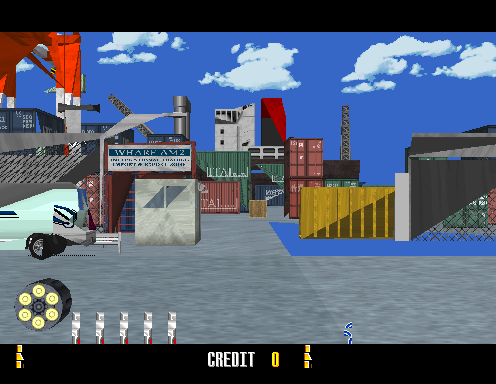

# model2recomp

```
 #   #   ###   ####   #####  #          ###
 ## ##  #   #  #   #  #      #         #   #
 # # #  #   #  #   #  ####   #            #
 #   #  #   #  #   #  #      #           #
 #   #   ###   ####   #####  #####      #####

 Sega Model 2 Hardware Runtime for Static Recompilation
```

> Link a statically recompiled Model 2 game against native C hardware. No
> emulator, no interpreter — the i960 program becomes your executable, and this
> library is the arcade board it runs on.

**[Join the sp00nznet recomp Discord](https://discord.gg/CRpzGWZFcu)** — the
community hub for sp00nznet's recomp projects. Good place to ask questions,
show a port you are working on, or find out what people are stuck on before
you duplicate the effort.

**Title-agnostic.** Nothing here knows what game it is running. The memory map,
geometry engine, rasterizer, coprocessor and I/O board all come from the board,
not the title. *Virtua Cop* (1994) is the reference game it was built against,
so the screenshots and some examples are its.

### Recent Changes

**Current version: v0.3.0 — _"Real Silicon"_ (September 2026).**
See the [Changelog](#changelog) for what landed and when.



*Virtua Cop's attract mode, drawn by this library from the game's own display
list: the geometry engine walks the command stream the recompiled i960 pushed
into buffer RAM, the rasterizer textures and z-sorts it, and the System 24
tilemap engine puts the HUD on top. The matrices behind it were computed by the
emulated MB86233 coprocessor running the game's own uploaded microcode.*

---

## What Is This?

Static recompilation replaces a console or arcade CPU with native code: you
lift the machine code to C, compile it for the host, and it runs directly on
your processor. That gets you a CPU — it does not get you a *machine*. The
lifted code still expects to write a polygon to a register at `0x00804000` and
have something draw it.

**model2recomp is that something.** It is the rest of a Sega Model 2 board as a
plain C library:

- a **memory bus** that routes the i960's 32-bit address space to the hardware
  behind it,
- an **i960 CPU context** — the register file, condition codes and call/return
  frame cache that lifted code operates on,
- the **geometry engine and 3D rasterizer**, a direct model of the hardware
  rather than a DSP emulator,
- the **MB86233 "TGP" math coprocessor**, which *is* a DSP emulator, because
  games upload their own microcode to it,
- **System 24 tilemaps**, palette, colour-translate and luma RAM,
- **timers, the interrupt controller, the I/O board** and backup SRAM,
- an **SDL2 platform layer** for window, input and presentation.

Your game project supplies the lifted i960 functions and a `main()`. This
library supplies everything they talk to.

### Why Not Just Use an Emulator?

MAME already runs Model 2, and runs it well — this library is *built from*
MAME's research and could not exist without it. Static recomp is a different
thing to want:

- **Native speed** — the game's own code is x86-64 machine code, not
  interpreted i960.
- **Moddability** — the game logic is C source you can read, patch and extend.
- **Portability** — the output targets anything with a C compiler.
- **Preservation** — a self-contained native binary with no emulator under it.
- **Understanding** — you cannot do this without learning the board properly.

## The Board

Model 2 (1993) is the hardware behind *Virtua Fighter 2*, *Daytona USA*,
*Virtua Cop* and *Sega Rally*. The original board:

| Part | Chip | Role |
|---|---|---|
| Main CPU | Intel i960KB @ 25 MHz | Game logic. **This is what gets recompiled.** |
| Math coprocessor | Fujitsu MB86233/86234 "TGP" | Matrix and vector maths, runs game-uploaded microcode |
| Geometry engine | Custom (TGP-based) | Transform, light, clip and z-sort the display list |
| Rasterizer | Sega/Lockheed-Martin custom | Textured, perspective-correct polygon fill |
| Tilemaps | Sega System 24 | Four 8×8 4bpp scroll layers, HUD and backgrounds |
| Sound | 68000 @ 10 MHz + YM3438 + 2× MultiPCM | Separate board, driven over a UART |
| I/O | Model 1 I/O Board 2 (837-11694) | Buttons, coins, lightgun, via dual-port RAM |

## Hardware Coverage

Honest status. "Done" means it does what the reference title needs and matches
MAME's behaviour where it was ported from it.

| Subsystem | Status | Notes |
|---|---|---|
| i960 CPU context | **Done** | Registers, condition codes, call/return frame cache, IAC reinitialize |
| Memory bus | **Done** | Full 32-bit map: ROM, work RAM, buffer RAM, video, I/O, copro |
| Function dispatch | **Done** | Hash table from i960 address to native function, for indirect calls |
| Execution model | **Done** | Field sync at the guest's video-status busy-wait; interrupts dispatched there |
| TGP math coprocessor | **Done** | Full MB86233 core, math-table ROM, banked buffer-RAM window, FIFOs |
| Geometry engine | **Done** | Command stream parse, transform, lighting, clipping, z-sort |
| 3D rasterizer | **Done** | Perspective-correct texturing, luma RAM, 32-ramp colour translate, gamma |
| System 24 tilemaps | **Done** | Four layers, 8×8 4bpp, drawn in two passes around the 3D scene |
| Timers | **Done** | 4× countdown timers off the 25 MHz clock |
| Interrupt controller | **Done** | Request / acknowledge / enable, all lines serviced |
| EEPROM / backup SRAM | **Done** | 16 KB, saved and restored |
| I/O board | **Partial** | Command handshake, buttons and lightgun all reach the guest through DPRAM. The board's EEPROM - coinage and game settings - is not modelled |
| Interrupt frame | **Done** | The handler runs with the context snapshotted and restored around it, which is what the hardware guarantees. `MODEL2_IRQMODE` keeps the other models for A/B |
| Platform (SDL2) | **Done** | Window, scaling, presentation, keyboard and mouse |
| Sound | **Stub** | UART handshake only — no 68000, no MultiPCM, no audio |
| Copro data ROM | **Not implemented** | The coprocessor's external data socket reads zero. Empty on the reference title; Daytona USA puts 4 MB there |
| Model 2A / 2B / 2C | **Not implemented** | The variant enum only labels a log line. 2A is close — same coprocessor, different I/O chip and RAM map. 2B needs an ADSP-21062 SHARC and 2C an MB86235 |

### What "rasterizer" means here, and what it does not

The rasterizer draws textured, perspective-correct, z-sorted polygons through
the hardware's real colour path — palette entry to one of 32 ramps per channel
in colour-translate RAM, indexed by luma, then gamma. What MAME does and this
does not: bilinear filtering, mipmaps and microtexture blending. Texels are
point sampled. See
[docs/technical/graphics-pipeline.md](docs/technical/graphics-pipeline.md).

## The Two TGPs

This trips everyone up, so it is worth being explicit. Model 2 has two things
called "TGP" and they are not the same component:

```
   recompiled i960 game code
        |                    \
        |  0x00880000/        \  0x00800000 geo registers
        |  0x00884000          \ 0x00804000 geo program port
        v                       v
  +----------------+     +---------------------+
  | MATH COPRO     |     | GEOMETRY ENGINE     |
  | MB86233 DSP    |     | (also TGP silicon)  |
  |                |     |                     |
  | src/copro.c    |     | src/geometry.c      |
  | EMULATED —     |     | MODELLED DIRECTLY — |
  | runs the game's|     | no DSP, the command |
  | own microcode  |     | stream is parsed    |
  +----------------+     +---------------------+
        |                       |
        | matrices,             | polygons
        | vectors               v
        +--------------> +---------------------+
                         | RASTERIZER          |
                         | src/geometry.c      |
                         +---------------------+
```

The **geometry engine** is modelled directly — it parses the display list and
produces polygons, exactly as MAME does, with no DSP involved. The **math
coprocessor** cannot be, because the game uploads microcode to it at boot and
then asks it to build every transformation matrix. Stub that and the game gets
its own inputs back as a matrix; see
[docs/technical/tgp-coprocessor.md](docs/technical/tgp-coprocessor.md).

## Building

```bash
cmake -B build
cmake --build build --config Release
```

Requires **CMake ≥ 3.20**, a **C17** compiler (MSVC 2022 and GCC tested), and
**SDL2**. On Windows, point CMake at vcpkg so `find_package(SDL2)` resolves:

```bash
cmake -B build -DCMAKE_TOOLCHAIN_FILE=C:/vcpkg/scripts/buildsystems/vcpkg.cmake \
               -DVCPKG_TARGET_TRIPLET=x64-windows
cmake --build build --config Release
```

**This repo builds a library.** There is no game executable here and there
never will be — the `.exe` is built by *your* game project, which links this.
`examples/minimal/main.c` is the smallest thing that calls the API.

| Option | Default | Effect |
|---|---|---|
| `MODEL2RECOMP_BUILD_EXAMPLES` | `ON` | Build `examples/minimal` |
| `MODEL2RECOMP_BUILD_TESTS` | `ON` | Build `tests/test_tilemap`, `tests/test_geometry` |

Game projects normally turn both off:

```cmake
set(MODEL2RECOMP_BUILD_EXAMPLES OFF CACHE BOOL "" FORCE)
set(MODEL2RECOMP_BUILD_TESTS    OFF CACHE BOOL "" FORCE)
add_subdirectory(ext/model2recomp)
target_link_libraries(my_game PRIVATE model2recomp)
```

## Integration Pattern

Your recompiled game registers every lifted function by its i960 address, then
hands control to the guest's own entry point. It never comes back — Model 2
games own their frame loop.

```c
#include "model2recomp/model2recomp.h"
#include "model2recomp/func_table.h"
#include "model2recomp/i960.h"
#include "model2recomp/bus.h"

int main(int argc, char **argv)
{
    model2recomp_init("My Model 2 Game", 2, MODEL2_ORIGINAL);
    model2recomp_load_rom(argc > 1 ? argv[1] : "roms");

    my_game_register_all();          /* generated: func_table_register(...) x N */

    I960_FP = bus_read32(PRCB + 0x18);
    I960_SP = I960_FP + 0x40;
    func_table_call(RESET_IP);       /* never returns; see Execution Model */

    model2recomp_shutdown();
    return 0;
}
```

The frame boundary is **inside the guest**, not in your `main()`. See
[docs/technical/execution-model.md](docs/technical/execution-model.md) — it is
the single most important thing to understand before you start.

## Repository Structure

```
model2recomp/
├── include/model2recomp/     Public API — one header per subsystem
│   ├── model2recomp.h          Init, frame loop, field sync, shutdown
│   ├── i960.h                  CPU context, registers, condition codes
│   ├── bus.h                   Memory access + ROM loading
│   ├── func_table.h            Address → native function dispatch
│   ├── video.h                 Geometry engine, rasterizer, tilemaps, palette
│   ├── copro.h                 MB86233 math coprocessor ports
│   ├── io.h, sound.h, timer.h, eeprom.h, platform.h
├── src/                      Implementation
│   ├── copro.c                 MB86233 core + Model 2 board glue   (956 lines)
│   ├── geometry.c              Geometry engine + rasterizer       (1374 lines)
│   ├── bus.c                   Address decode                      (748 lines)
│   ├── video.c                 Video registers, tilemaps, palette  (511 lines)
│   ├── model2recomp.c          Lifecycle, field sync, IRQ dispatch (372 lines)
│   ├── io.c, timer.c, i960.c, func_table.c, eeprom.c, sound.c
│   └── platform_sdl.c
├── examples/minimal/         Smallest program that calls the API
├── tests/                    Standalone subsystem harnesses
├── docs/                     Getting started + technical deep dives
└── ref/                      Local scratch for MAME sources (git-ignored,
                              never redistributed)
```

## Documentation

### Start here

- **[Getting Started](docs/GETTING_STARTED.md)** — build a Model 2 port from a
  ROM dump, end to end.
- **[Execution Model](docs/technical/execution-model.md)** — where the frame
  boundary is, how interrupts land, why `main()` never gets control back.

### Technical deep dives

- **[Hardware Overview](docs/technical/hardware-overview.md)** — the board, the
  full memory map, what each region does.
- **[Graphics Pipeline](docs/technical/graphics-pipeline.md)** — display list,
  geometry engine, rasterizer, and the colour path.
- **[TGP Coprocessor](docs/technical/tgp-coprocessor.md)** — MB86233, the FIFO
  protocol, the math-table ROMs, and how it is scheduled.
- **[Debugging](docs/technical/debugging.md)** — environment variables, traces,
  screenshots, and how to find out why guest code never runs.
- **[Porting Targets](docs/technical/porting-targets.md)** — which Model 2
  games are reachable from here, and what each one still needs.

## Games That Work Well As Targets

Original Model 2 titles, since that is the variant implemented:

| Game | Year | Why it is a reasonable target |
|---|---|---|
| **Virtua Cop** | 1994 | The reference title — this library was built against it |
| **Daytona USA** | 1993 | **The obvious next one.** Same board, half the program ROM, and exactly one gap: it fills the coprocessor's data ROM socket, which Virtua Cop leaves empty |
| **Virtua Fighter 2** | 1994 | Same board; character animation is CPU-side, so it is mostly a lifter problem |

2A-CRX is closer than it looks — it runs the *same* MB86233 coprocessor, and
differs in its I/O chip and program-RAM map. 2B and 2C need a SHARC and an
MB86235 respectively, which are separate DSP projects.
**[docs/technical/porting-targets.md](docs/technical/porting-targets.md)** works
through every title and what each one needs.

## Projects Using This Library

- **[virtuacop](https://github.com/sp00nznet/virtuacop)** — *Virtua Cop*
  (Sega, 1994). Boots, runs its own frame loop, and renders attract mode.

## How You Can Help

The gaps are well defined, and none of them need permission to start:

- **Sound.** `src/sound.c` is a UART handshake and nothing else. A 68000 core
  plus MultiPCM would make this the first Model 2 recomp with audio.
- **The I/O board EEPROM.** Buttons work; the 93C46 holding coinage and game
  settings does not exist. Virtua Cop defaults to free play without it, which
  is convenient and not correct.
- **Rasterizer fidelity.** Bilinear filtering, mipmaps and microtexture
  blending are all in MAME's `model2rd.ipp` and absent here.
- **The coprocessor data ROM.** Two lines and a load hook, but untestable
  until a title that uses it is ported — Daytona USA is the one.
- **Board variants.** 2A-CRX is a memory-map and I/O-chip job on the same
  coprocessor. 2B-CRX (ADSP-21062 SHARC) and 2C-CRX (MB86235) are new DSP
  cores.
- **Another title.** The fastest way to find out what is title-specific in here
  is to point it at a game that is not Virtua Cop.

## Dependencies

| Dependency | Why | Required |
|---|---|---|
| SDL2 | Window, presentation, input, audio output | Yes |
| CMake ≥ 3.20 | Build | Yes |
| C17 compiler | MSVC 2022 / GCC / Clang | Yes |

No other third-party code is linked. MAME is a *reference*, not a dependency —
nothing from it ships here.

### Running the tests

```bash
cmake --build build --config Release
./build/Release/model2recomp_test_tilemap
./build/Release/model2recomp_test_geometry
```

Both are self-checking: each prints one line per check and exits non-zero if
any fail. They cover tilemap pixel order, transparency, scrolling and pass
selection; and, for the geometry engine, projection position, culling behind
the eye, and depth sorting. They do not need ROMs.

## FAQ

**Does this run Model 2 games on its own?**
No. It is the board, not the game. You need a statically recompiled i960
program to link against it — see [virtuacop](https://github.com/sp00nznet/virtuacop)
for a worked example.

**Do I need ROMs?**
To run a game, yes, and you must dump them yourself. None are distributed here
and none ever will be. The library loads flat binaries that a game project's
tooling produces from a ROM set.

**Why is the geometry engine not emulated like the coprocessor is?**
Because it does not need to be, and MAME reached the same conclusion. The
geometry TGP runs fixed Sega microcode that always does the same thing;
modelling the result directly is simpler and faster than emulating the DSP. The
*math* coprocessor runs microcode the game supplies, which varies per title, so
there it is emulate or nothing.

**Can it target Model 2A/2B/2C?**
Not yet. The enum accepts them and the log line prints them; no code branches
on them.

**Why is my recompiled game hanging?**
Almost always the field sync. Guest code busy-waits on bit 2 of `0x0098000C`,
and that read is what advances the frame. If your bus is not routing it to
`model2recomp_field_sync()`, the guest spins forever. `MODEL2_TRACE=N` names
the function it is spinning in.

## License

**MIT** — see [LICENSE](LICENSE). Parts of this library are ports of MAME code,
and a port is a derivative work: those files keep MAME's licence and its
copyright holders.

| Component | Licence | Copyright |
|---|---|---|
| ports of MAME code in `src/geometry.c`, `src/copro.c`, `src/video.c`, `src/bus.c`, `src/timer.c`, `src/i960.c`, `src/io.c` | BSD-3-Clause | R. Belmont; Olivier Galibert; ElSemi; Angelo Salese; Matthew Daniels; Farfetch'd; Dirk Best |
| everything else | MIT | sp00nz and contributors |

BSD-3-Clause is permissive and asks only that the notice and the copyright
survive; [LICENSES/BSD-3-Clause.txt](LICENSES/BSD-3-Clause.txt) is the verbatim
text and [NOTICE](NOTICE) maps every derived file to the MAME source and the
people who wrote it. No MAME source is redistributed in this repository.

## Credits

The Model 2 was reverse-engineered by the MAME team over two decades. This
library is a port of that work into a different shape, not a rediscovery of it.
**R. Belmont, Olivier Galibert, ElSemi, Angelo Salese, Matthew Daniels,
Farfetch'd** and **Dirk Best** wrote the code it is derived from.

Built with [Claude Code](https://claude.ai) (Anthropic).

## Changelog

### v0.3.0 — *"Real Silicon"* (September 2026)

- **MB86233 math coprocessor emulated** (`src/copro.c`, new). The Model 2's
  *other* TGP is a real DSP that games upload microcode to, and Virtua Cop
  builds every transformation matrix on it. With the FIFO stubbed as a
  loopback the game read its own inputs back as a matrix — a position, a raw
  integer angle, three 2.0s and a NaN — which pushed 44% of polygons into the
  nearest z bucket and flattened the scene. Now the full instruction set, the
  CPU board's math-table ROM (sin/cos, atan, 1/x, 1/√x), the banked buffer-RAM
  window and both FIFOs are modelled, and the DSP runs on demand: a FIFO read
  executes it until it produces a word or starves on empty input.
- **Stopped re-rendering stale display lists.** Projection rewrites each vertex
  in place, so re-rendering a field the game had not resubmitted threw the
  geometry off screen; the picture alternated between the scene and nothing.
  `geo_render_polygons` now honours `render_done`, as MAME does.
- `MODEL2_SHOT_EVERY=N` writes a screenshot every N fields, so one run samples
  a whole attract cycle.

### v0.2.0 — *"Pixels"* (September 2026)

- **Geometry engine and 3D rasterizer ported** from MAME's `model2_v.cpp`:
  display-list parse, transform, lighting, clipping, z-sort, and a
  perspective-correct textured fill.
- **The real colour path.** Palette entry selects one of 32 ramps per channel
  in colour-translate RAM, indexed by luma — from the texel through luma RAM
  for textured pixels — then gamma. Replaced a placeholder that guessed RGB.
- **Texture origin fixed** and translucency honoured; display lists are parsed
  only once the game publishes them, not mid-write.
- **System 24 tilemaps**: four layers, drawn in two passes around the 3D scene.
- **Interrupt dispatch** at the field boundary, following the hardware's path:
  interrupt controller → external line → ICR vector → PRCB interrupt table.
  Every line is serviced, and the sound interrupt is raised.
- **Control flow the guest actually uses**: IAC reinitialize (the reset stub's
  handoff to the real firmware entry), the I/O board command acknowledge, and
  the video field-sync frame boundary.

### v0.1.0 — *"Board Bring-Up"* (March 2026)

- Initial library: i960 CPU context, 32-bit memory bus, function dispatch
  table, timers, interrupt controller, EEPROM, I/O board DPRAM, SDL2 platform
  layer, and subsystem stubs for everything else.
- Flat-binary ROM loading.

## References

- [MAME](https://github.com/mamedev/mame) — `sega/model2.cpp`, `model2_v.cpp`,
  `model2rd.ipp`, `segaic24.cpp`, `model1io2.cpp`, `cpu/i960/i960.cpp`,
  `cpu/mb86233/mb86233.cpp`. The source of essentially everything known about
  this board.
- [N64Recomp](https://github.com/N64Recomp/N64Recomp) — showed static
  recompilation of a console target was practical.
- [XenonRecomp](https://github.com/hedge-dev/XenonRecomp) — the same idea for
  Xbox 360 PowerPC.
- [ps3recomp](https://github.com/sp00nznet/ps3recomp),
  [xboxrecomp](https://github.com/sp00nznet/xboxrecomp) — sibling projects in
  the same family.
